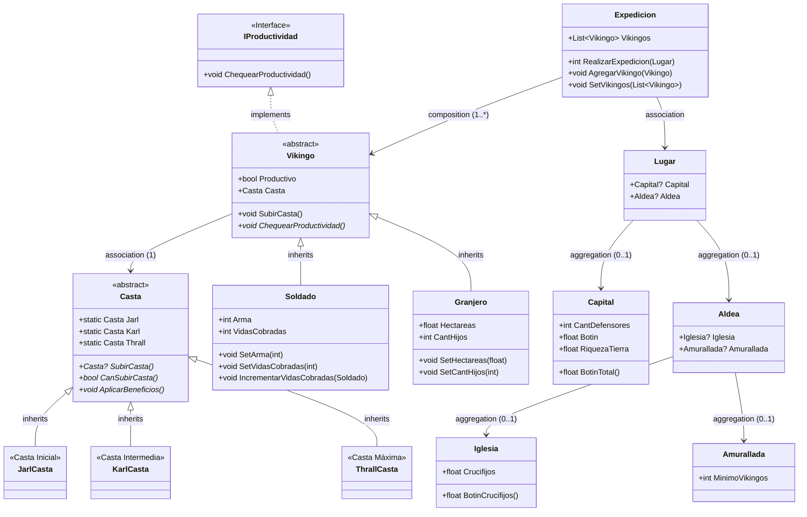

# Diagrama UML - Vikingos

## Diagrama de Clases

## Descripción de Clases

### Clases Abstractas

| Clase | Descripción |
|-------|-------------|
| `Vikingo` | Clase base abstracta para todos los tipos de vikingos. Implementa `IProductividad`. |
| `Casta` | Clase base abstracta para el sistema de castas. Implementa patrón Singleton con propiedades estáticas. |

### Clases Concretas de Castas

| Clase | Descripción |
|-------|-------------|
| `JarlCasta` | Representa la casta inicial. Singleton accesible vía `Casta.Jarl`. |
| `KarlCasta` | Representa la casta intermedia. Singleton accesible vía `Casta.Karl`. |
| `ThrallCasta` | Representa la casta máxima. Singleton accesible vía `Casta.Thrall`. |

### Tipos de Vikingos

| Clase | Atributos | Productividad |
|-------|-----------|---------------|
| `Soldado` | `Arma`, `VidasCobradas` | ≥20 vidas cobradas |
| `Granjero` | `Hectareas`, `CantHijos` | ≥2 hectáreas por hijo |

### Sistema de Expediciones

| Clase | Descripción |
|-------|-------------|
| `Expedicion` | Contiene una lista de vikingos productivos y realiza expediciones a lugares. |
| `Lugar` | Puede contener una Capital y/o una Aldea. |
| `Capital` | Tiene defensores y riqueza de tierra. Calcula botín total. |
| `Aldea` | Tiene una Iglesia O una estructura Amurallada (exclusivo). |
| `Iglesia` | Contiene crucifijos que se convierten en botín (x2.5). |
| `Amurallada` | Requiere mínimo de vikingos para ser saqueada. |

## Patrones de Diseño Utilizados

1. **Strategy**: Las clases de castas encapsulan el comportamiento de cada casta.
2. **Singleton**: Las castas (Jarl, Karl, Thrall) son singletons accesibles mediante propiedades estáticas.
3. **Template Method**: La clase `Vikingo` define el método `SubirCasta()` que usa métodos abstractos de `Casta`.
